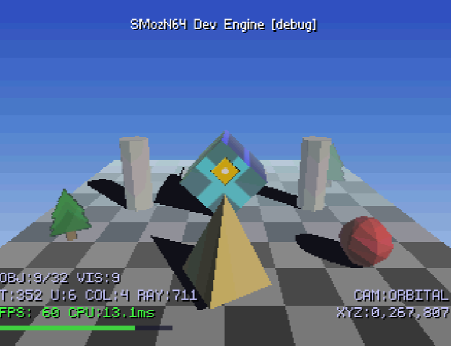
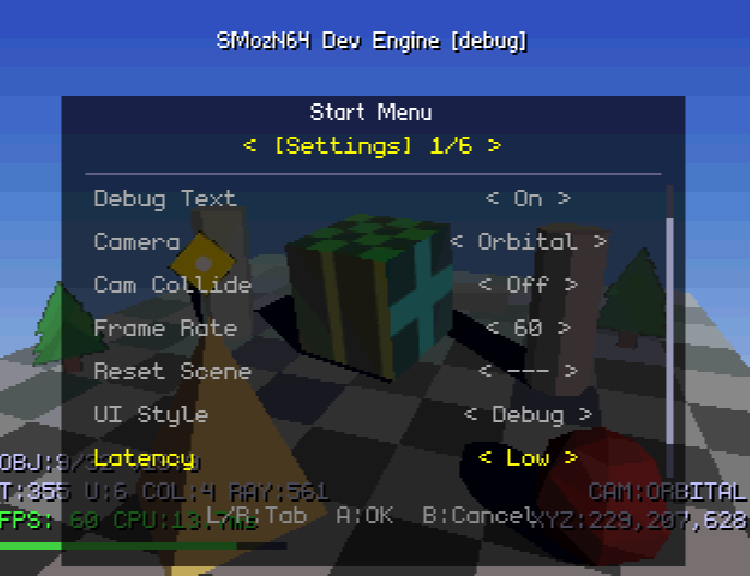
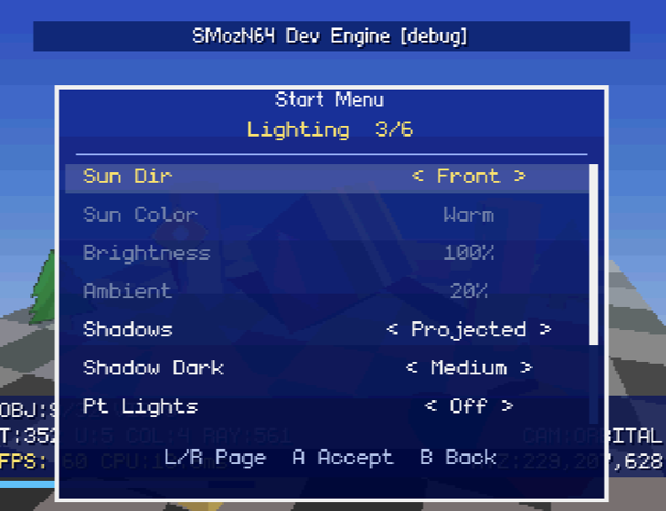
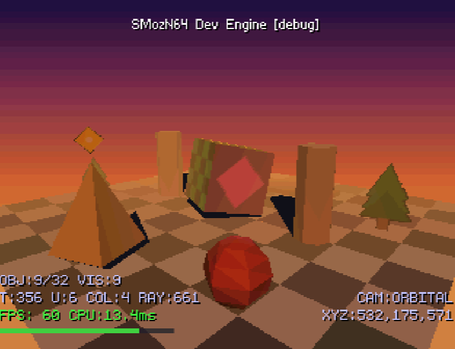
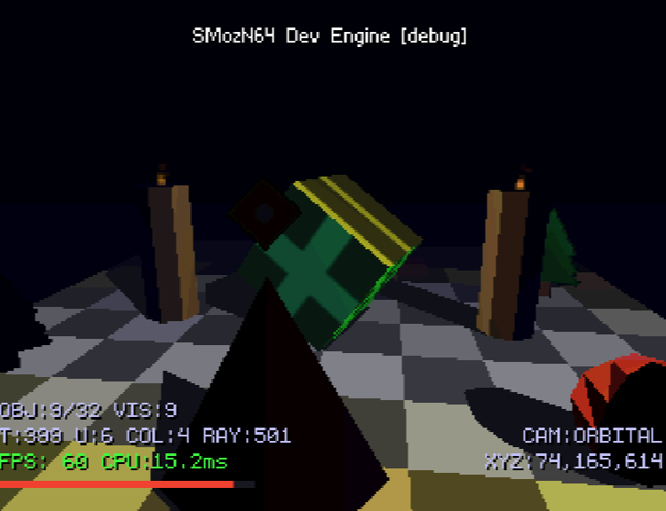
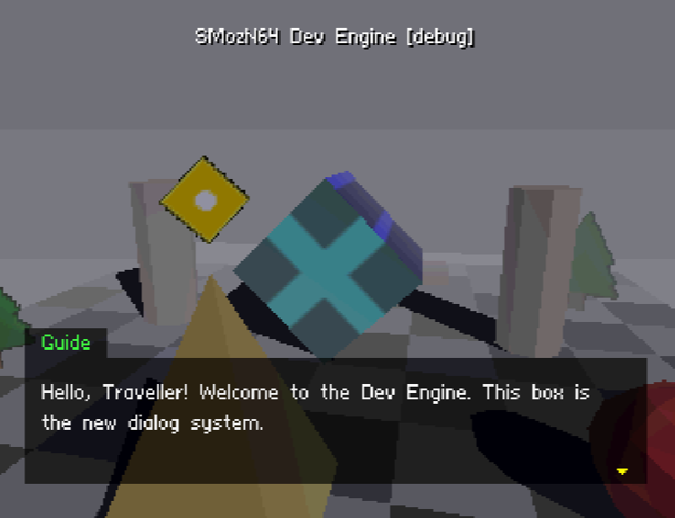
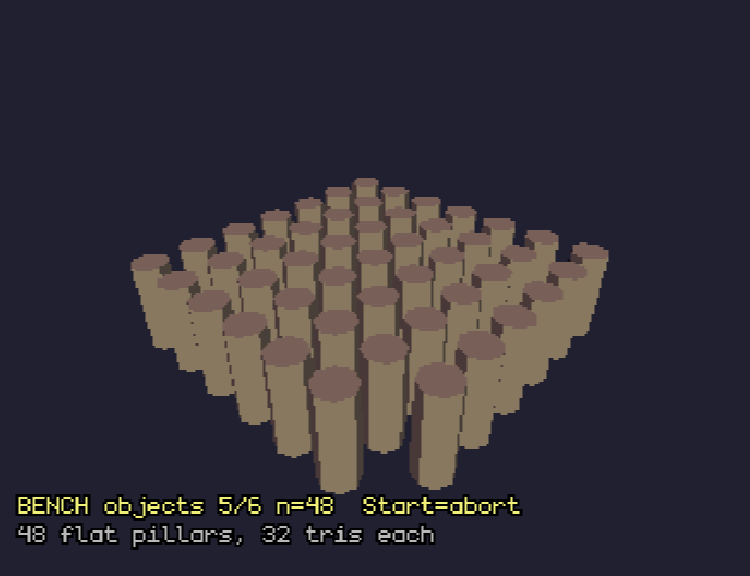
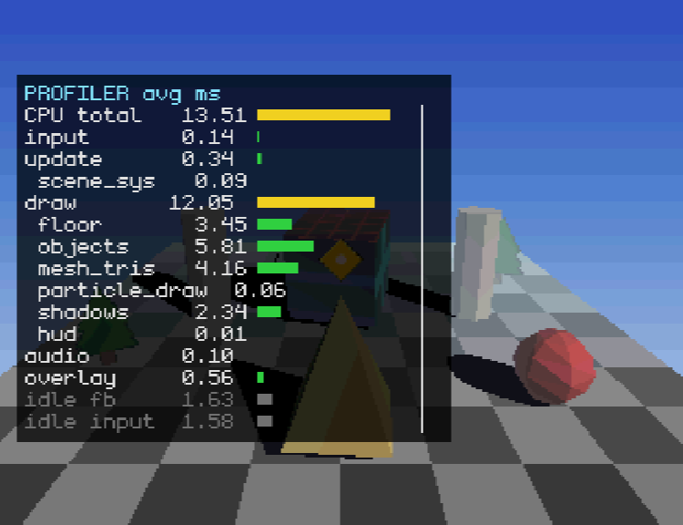
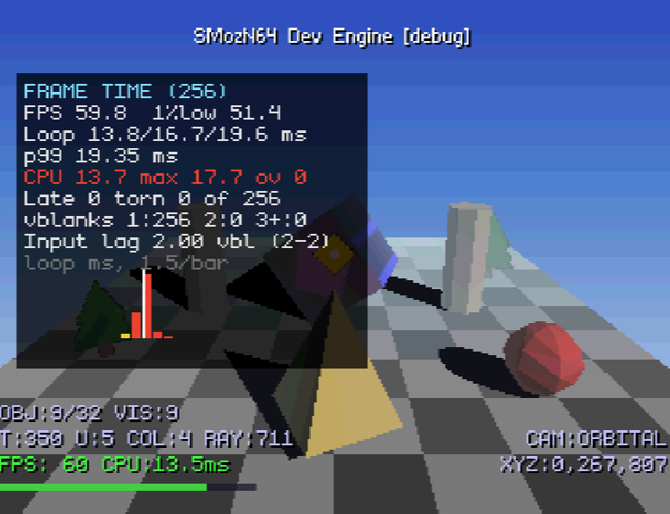
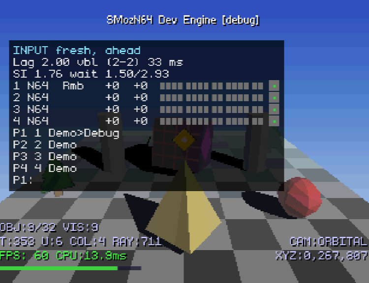

# N64 Dev Engine

A Nintendo 64 homebrew game engine built with [libdragon](https://github.com/DragonMinded/libdragon). Provides modular building blocks for N64 game development — pick the subsystems you need and build on top of them. The long-term goal is an action-RPG engine (souls-like combat, tactics-style battles) that stays general enough for other genres.

**Verified on real hardware** (Analogue 3D via SummerCart64) and the ares emulator. Developed on Windows 11 and macOS. Every stage of the [roadmap](docs/ROADMAP_v2.md) is measured on the Analogue 3D before it is committed ([BENCHMARKS.md](docs/BENCHMARKS.md)).



## In Pictures

All captured in ares from the scripted screenshot tour (`make TOUR=1`, [DEBUGGING.md](docs/DEBUGGING.md#screenshot-tour)). Timings on screen are ares's, about 2.5× the Analogue 3D's: on the console the demo scene takes 5–7 ms of CPU per frame.

| | |
|---|---|
|  |  |
| **Start menu**: six tabs of options built from one table, live apply with cancel/revert, D-pad or stick with auto-repeat | **UI styles**: Debug, Classic and Minimal restyle the menu, HUD and text box live |
|  |  |
| **Atmosphere**: 7 presets with sky gradients, fog and linked lighting | **Point lights**: torch particles and per-tile floor lighting at night |
|  |  |
| **Dialog**: conversations written in JSON, typewriter reveal, pages and choices | **Benchmark scene**: 12 kinds of stress steps, CSV rows over USB |
|  |  |
| **Profiler page**: per-stage CPU time against the 16.7 ms budget | **Frame page**: what reached the screen, including input lag |
|  | |
| **Input page**: all four ports live, controller-read timing, measured input lag, each player's context stack | |

## Engine Subsystems

| Subsystem | Description | Docs |
|-----------|-------------|------|
| **Engine core** | Hardware bring-up and the frame loop; frame pacing (throughput or low latency), 30/60 FPS cap, presented-frame and input-lag tracking | [ENGINE.md](docs/ENGINE.md) |
| **Rendering** | Software 3D transforms + hardware RDP rasterization, Z-buffer; render hot path pinned in the I- and D-caches | [RENDERING.md](docs/RENDERING.md), [HARDWARE.md](docs/HARDWARE.md) |
| **Mesh System** | Generic mesh builder, shape library (cube, pillar, platform, pyramid, sphere) | [MESH_SYSTEM.md](docs/MESH_SYSTEM.md) |
| **Camera** | Orbital/fixed/follow camera, perspective projection, collision, frustum culling | [CAMERA.md](docs/CAMERA.md) |
| **Textures** | Sprite slots, per-scene loading, TMEM upload | [TEXTURES.md](docs/TEXTURES.md) |
| **Lighting** | Blinn-Phong with configurable sun, point lights, and shadow casting | [ARCHITECTURE.md](docs/ARCHITECTURE.md) |
| **Shadows** | Blob shadows and projected shadow silhouettes on the floor plane | [ARCHITECTURE.md](docs/ARCHITECTURE.md) |
| **Billboards** | Camera-facing textured quads (spherical and cylindrical modes) | [BILLBOARDS.md](docs/BILLBOARDS.md) |
| **Particles** | Emitter-based system with pool allocation, additive and alpha blending (fire, smoke), direct RDP batch renderer | [PARTICLES.md](docs/PARTICLES.md) |
| **Atmosphere** | Fog (hardware + CPU hybrid), sky gradients, 7 presets with linked lighting | [ARCHITECTURE.md](docs/ARCHITECTURE.md) |
| **Physics** | Semi-fixed timestep, gravity, bounce, impulse, ground detection, kinematic bodies | [PHYSICS.md](docs/PHYSICS.md) |
| **Audio** | Crossfading music, 8 prioritised SFX voices, positional sound, master/music/SFX volumes | [AUDIO.md](docs/AUDIO.md) |
| **Collision** | Sphere and AABB colliders, raycasting, layers, camera pushout | [COLLISION.md](docs/COLLISION.md) |
| **Scene** | Objects that own their collider and physics body, flags, update/draw callbacks, transitions, soft reset | [SCENE_SYSTEM.md](docs/SCENE_SYSTEM.md) |
| **Input & Actions** | 4 players on any port; layered action contexts (consume, modal); buttons, chords, stick directions and analog axes with deadzones and curves; repeat, held time, rumble, hot-plug; input read at the lowest-latency point of the frame and measured | [INPUT.md](docs/INPUT.md) |
| **UI** | Three styles, cached text layers, HUD panels, tabbed menu (model + view), text box | [UI.md](docs/UI.md), [MENU_SYSTEM.md](docs/MENU_SYSTEM.md) |
| **Settings** | The game's options as one table: choices and values side by side, typed accessors, change tracking | [MENU_SYSTEM.md](docs/MENU_SYSTEM.md) |
| **Dialog** | Conversations in JSON compiled at build time; events, conditions, variables, choices | [DIALOG.md](docs/DIALOG.md) |
| **Developer tools** | Debug menu tab; overlay pages (stats, profiler, memory, frame time, RSP/RDP, input); CSV export over USB; RDP validator and capture; crash test; Reset Soak and Menu Sweep; benchmark scene; screenshot tour; host unit tests; CI with ROM/RAM budgets and cache-layout checks | [DEBUGGING.md](docs/DEBUGGING.md), [PROFILING.md](docs/PROFILING.md), [BENCHMARKS.md](docs/BENCHMARKS.md) |

## Current Demo

A multi-object scene with lighting, atmosphere, shadows, and full camera controls running at 60 FPS:

- Textured rotating cube, pillars, pyramid, platform, a static sphere, and billboard trees
- Orbital, fixed and follow cameras; the analog stick orbits, the C-buttons zoom and shift the view
- Per-face texture mapping with bilinear filtering and perspective correction
- Blinn-Phong lighting with configurable sun direction, colour and intensity; point lights with per-tile floor illumination and torch flames on the pillars
- Blob and projected shadows
- 7 atmosphere presets (Clear Day, Overcast, Foggy, Dense Fog, Sunset, Dusk, Night) with fog, sky gradients and linked lighting
- Object selection and move/rotate/scale by hand; a physics ball (B) that bounces on the platform
- Up to 4 players: every controller can open the Start menu (whoever opens it drives it) and launch the ball; the ball's bounces rumble on the launcher's Rumble Pak
- Tabbed Start menu: Settings, Sound, Lighting, Environ, Controls (remappable buttons) and Debug; three UI styles
- Input latency setting: Classic, Low (default) or Lowest, 3 / 2 / 1 vblanks from controller read to screen
- A dialog conversation with choices (Debug → Dialog)
- Background music and sound effects (muted at boot: Start → Sound → Master)
- Scene reset without a console restart
- Developer tools in the Debug tab: overlay pages, CSV export over USB, RDP validator and frame capture, crash test, reset-soak and menu-sweep tests, and a benchmark scene

## Quick Start

Full instructions, including the Windows USB driver and line-ending steps, are in [docs/SETUP.md](docs/SETUP.md).

### Prerequisites

| | Windows 11 | macOS |
|---|---|---|
| Docker Desktop (WSL2 backend on Windows) | `wsl --install --no-distribution`, reboot, `winget install -e --id Docker.DockerDesktop` | `brew install --cask docker` |
| Node.js ≥ 24 + libdragon CLI | `winget install -e --id OpenJS.NodeJS.LTS` then `npm install -g libdragon` | `brew install node` then `npm install -g libdragon` |
| ares emulator (enable Homebrew Mode) | `winget install -e --id ares-emulator.ares` | `brew install --cask ares` |
| sc64deployer (SummerCart64) | zip from the [releases](https://github.com/Polprzewodnikowy/SummerCart64/releases) → `C:\tools\sc64deployer` on PATH, plus the FTDI VCP driver | tgz from the releases → `/usr/local/bin` |

Python 3 on the host is optional: the scripts in `tools/` also run in the build container (`libdragon exec python3 tools/<tool>.py …`).

### Build & Run

```powershell
git clone --recurse-submodules <repo-url>
cd n64-analogue3d-engine
# Windows only: set core.autocrlf=false / core.eol=lf in the repo and libdragon/,
# then re-checkout both working trees (SETUP.md step 6)

libdragon init                       # first time: create the container and build libdragon into it
libdragon make                       # -> engine-debug.z64 (debug build: logs, asserts, profiler)
libdragon make BUILD=release         # -> engine.z64 (debug code compiled out)
libdragon make BENCH=1               # -> engine-debug-bench.z64: boots straight into the benchmark
libdragon make TOUR=1                # -> engine-debug-tour.z64: the scripted screenshot tour

ares .\engine-debug.z64                # emulator      (macOS: open -a ares engine-debug.z64)
sc64deployer upload .\engine-debug.z64 # cart, then power on / reset the console
sc64deployer debug                   # optional: live debugf() log from the console
```

Day-to-day workflow, tests and CI: [docs/WORKFLOW.md](docs/WORKFLOW.md). Adding scenes, meshes, textures, controls, menu items and the rest: [docs/EXTENDING.md](docs/EXTENDING.md).

## Controls

Player 1's game controls are remappable in the Controls tab. Every player has the same defaults.

| Action | Default | Description |
|--------|---------|-------------|
| Orbit camera | Analog stick | Horizontal/vertical camera orbit (moves the object in transform mode) |
| Zoom in / out | C-Up / C-Down | Camera distance (held) |
| Shift view up / down | C-Right / C-Left | Camera target Y (held) |
| Confirm | A | Enter transform mode, cycle move/rotate/scale |
| Cancel / Ball | B | Back; in normal mode, launch the physics ball (any player) |
| Select mode | Z | Toggle object selection |
| Cycle next / prev | D-Right / D-Left | Cycle through objects |
| Camera mode | R / L | Cycle camera modes |
| Menu | Start | Opens the Start menu (any player; that player drives it). Not remappable |
| Overlay page / CSV dump | D-Up / D-Down | Developer shortcuts, player 1, while no game control uses the button |

In menus and the dialog box: D-pad or stick to move (repeats while held), L/R to switch tabs, A to confirm, B to cancel, Start to close the menu.

## Project Structure

```
n64-analogue3d-engine/
├── src/
│   ├── main.c                 # The demo game: Start menu, scene manager, scene switches
│   ├── engine/                # engine.c/h (init, frame loop, pacing), engine_config.h, util.h,
│   │                          # hot.h + hot_text.ld / hot_data.ld (cache placement of the render path)
│   ├── math/vec3.h            # 3D vector math
│   ├── render/                # camera, mesh (builder + mesh_draw), mesh_defs, cube, floor, billboard,
│   │                          # lighting, shadow, particle (+ particle_draw), atmosphere, texture
│   ├── input/
│   │   ├── pad.c/h            # Controller state per port (PadState)
│   │   ├── action.c/h         # Players, contexts, bindings, action state (host-tested)
│   │   └── input.c/h          # Input core: joypad, fresh-read wait, pads, rumble, input lag
│   ├── collision/             # Sphere/AABB colliders, raycasting, layers
│   ├── physics/               # Bodies: gravity, bounce, impulse, ground detection
│   ├── scene/                 # Scene lifecycle, manager, transitions, soft reset; scene_objects.c
│   ├── scenes/
│   │   ├── demo_scene.c/h     # The demo: objects, interaction, menu semantics, HUD
│   │   ├── demo_controls.c/h  # The demo's actions, default bindings and names
│   │   ├── demo_tour.c/h      # Scripted screenshot tour (make TOUR=1)
│   │   └── benchmark_scene.c/h # Benchmark scene: stress steps, BENCH CSV rows
│   ├── audio/                 # Sound module, voice mixing (host-tested), sound bank
│   ├── ui/                    # text, menu (model) + menu_view, settings (the options table), ui_input,
│   │                          # ui_layer (cached text), ui_hud, ui_style, ui_draw, textbox
│   ├── dialog/                # Dialog runner (host-tested)
│   └── debug/                 # Debug tab, profiler, stats, memory, frame time, overlay pages,
│                              # RDP capture, Reset Soak / Menu Sweep
├── tests/host/                # Host unit tests + libdragon shim (make -C tests/host run)
├── tools/                     # bench_compare.py, ci_build.sh, hot_text.py, hot_data.py, rom_budget.py,
│                              # dialog_build.py, disasm.sh, rdp_log_to_hex.py, rspq_profile.ps1, ...
├── assets/                    # Source PNGs, WAVs, fonts, dialog JSON (converted at build time)
├── filesystem/                # Generated outputs (git-ignored), bundled into the ROM
├── libdragon/                 # libdragon submodule (preview branch, pinned)
├── docs/                      # Engine documentation (list below)
│   ├── benchmarks/            # Committed benchmark captures (CSV)
│   └── images/                # Screenshots
├── .github/workflows/build.yml # CI: both ROMs, host tests, budgets, cache-layout checks
├── .libdragon/config.json     # libdragon CLI: Docker image + submodule vendoring
├── .vscode/tasks.json         # Build / run / upload / debug tasks (per-OS)
├── .gitattributes             # LF line endings (required by the Linux build container)
├── Makefile                   # Debug/release/bench/tour variants, asset rules, link script
└── CLAUDE.md                  # AI assistant project context
```

## Technical Overview

### Rendering Pipeline

```
CPU: Input → Scene Update → Camera → Model Matrix → Frustum Cull
     → Backface Cull + Lighting (per face group) → MVP Transform → Viewport Map
RDP: Triangle Rasterize → Texture Sample → Z-Buffer → Framebuffer
```

- **Display**: 320x240, 16-bit color, triple-buffered
- **Depth**: 16-bit hardware Z-buffer
- **Triangles**: `rdpq_triangle()` with `TRIFMT_ZBUF_TEX` (textured) or `TRIFMT_ZBUF` (flat), `TRIFMT_ZBUF_SHADE(_TEX)` when fog is on
- **Textures**: 32x32 RGBA16 sprites, bilinear filtered, perspective-correct
- **Lighting**: CPU-side flat-shaded Blinn-Phong (per face group; per triangle on curved surfaces) with configurable sun, point lights, and shadow casting
- **Atmosphere**: Hybrid fog (hardware RDP + CPU), sky gradients, 7 presets with linked lighting hints
- **Input**: controllers read at every vblank; the frame acts on the read of the vblank it starts at, 2 vblanks from read to screen by default (1 with low-latency pacing), measured for every frame ([ENGINE.md](docs/ENGINE.md#input-and-latency-s9))
- **Performance**: CPU-bound; 32 flat 32-triangle objects (~500 triangles) run at 60 FPS on the Analogue 3D with ~4.8 ms to spare ([BENCHMARKS.md](docs/BENCHMARKS.md))
- **Footprint** (Phase 2 S9): ROM 688,128 bytes (debug) / 475,136 bytes (release); CI fails a release ROM over 4 MB or over 1 MB of static code and data (`tools/rom_budget.py`)

### Critical Hardware Rule

**Fill mode is ONLY for rectangles.** Triangles must use standard (1-cycle) mode or they crash on real hardware. The ares emulator is lenient about this — always test on hardware.

## Documentation

- [Development Roadmap v2](docs/ROADMAP_v2.md) — Phased plan: tooling & benchmarking, engine hardening, graphics features, Tiny3D, animation, game framework
- [Roadmap v1](docs/ROADMAP.md) — Delivery record for Features 1–10
- [Engine Core](docs/ENGINE.md) — Init, the frame loop, pacing, input latency
- [Architecture](docs/ARCHITECTURE.md) — N64 hardware overview, libdragon stack, lighting, shadows, particles, fog
- [Rendering Pipeline](docs/RENDERING.md) — RDP modes, Z-buffer, triangle formats, frame structure
- [Mesh System](docs/MESH_SYSTEM.md) — Mesh builder API, shape library, universal renderer
- [Particles](docs/PARTICLES.md) — Emitters, effect definitions, the batch renderer
- [Billboards](docs/BILLBOARDS.md) — Camera-facing textured quads
- [Audio](docs/AUDIO.md) — Sound module, sound bank, encodings, poll point and measured cost
- [Camera System](docs/CAMERA.md) — Orbital camera, coordinate system, math library, frustum culling
- [Texture System](docs/TEXTURES.md) — Asset pipeline, TMEM constraints, sprite slots, per-scene loading
- [Collision System](docs/COLLISION.md) — Colliders, raycasting, layers, overlap queries
- [Physics System](docs/PHYSICS.md) — Gravity, bounce, impulse, semi-fixed timestep, body presets
- [Scene System](docs/SCENE_SYSTEM.md) — Lifecycle, scene manager, objects with colliders and bodies, transitions, soft reset
- [Input System](docs/INPUT.md) — Pads, players, action contexts and bindings, analog processing, rumble, latency
- [Menu System](docs/MENU_SYSTEM.md) — API reference, data model, the settings table
- [UI](docs/UI.md) — Styles, cached text layers, HUD, menu view
- [Dialog](docs/DIALOG.md) — JSON conversations, the runner, the text box
- [Debugging](docs/DEBUGGING.md) — Debug tab (incl. Reset Soak and Menu Sweep), log channels, RDP validator and capture, crash inspector, unit tests, screenshot tour
- [Profiling](docs/PROFILING.md) — CPU profiler, stats, memory, frame time, RDP counters, CSV rows
- [Benchmarks](docs/BENCHMARKS.md) — Measured performance on the Analogue 3D, stage by stage
- [Hardware Notes](docs/HARDWARE.md) — Analogue 3D + SummerCart64 facts, RDP rules, CPU caches and code/data placement
- [Environment Setup](docs/SETUP.md) — Windows 11 and macOS: Docker, libdragon CLI, ares, SummerCart64 + driver
- [Development Workflow](docs/WORKFLOW.md) — Build cycle, debugging, asset pipeline, hardware testing
- [Extending the Engine](docs/EXTENDING.md) — Recipes (scene, mesh, texture, controls, menu item, Debug item, profiler slot, stats counter, benchmark kind, host test, hot-path code, sound, dialog) and the contribution stage gate

## Roadmap at a Glance

See [ROADMAP_v2.md](docs/ROADMAP_v2.md) for the full plan with per-feature test plans and benchmark targets.

| Phase | Goal |
|-------|------|
| 0 — Environment & baseline | Windows 11 workflow reproducible, ROM verified on ares + Analogue 3D (done 2026-09-12) |
| 1 — Tooling & benchmarking | Per-phase profiler, unified stats, memory/frame-time overlays, RDP validator + capture, benchmark scene + CSV, CI (done 2026-09-23) |
| 2 — Engine hardening | Leaks, renderer correctness, hot paths, mesh memory, UI core and dialog, engine core and frame pacing, cache-pinned render path, scene-owned physics, settings table, input (stages S0–S9 done; S10–S13 next) |
| 3 — Graphics features (CPU path) | Vertex cache, Gouraud lighting, sprite animation, CI4/TMEM residency, fonts, VI options, decals, skybox, sorted transparency |
| 4 — Milestone 1: Tiny3D | libdragon upgrade, RSP rendering, Blender/Fast64 → GLTF → ROM pipeline, 64+ objects at 60 FPS |
| 5 — Milestone 2: Animation | Skeletal animation, character controller, state machine, entity pattern, FFT grid track |
| 6 — Milestone 3: Game framework | Souls-like arena, turn-based battle system, save/load, AI |

## License

MIT
